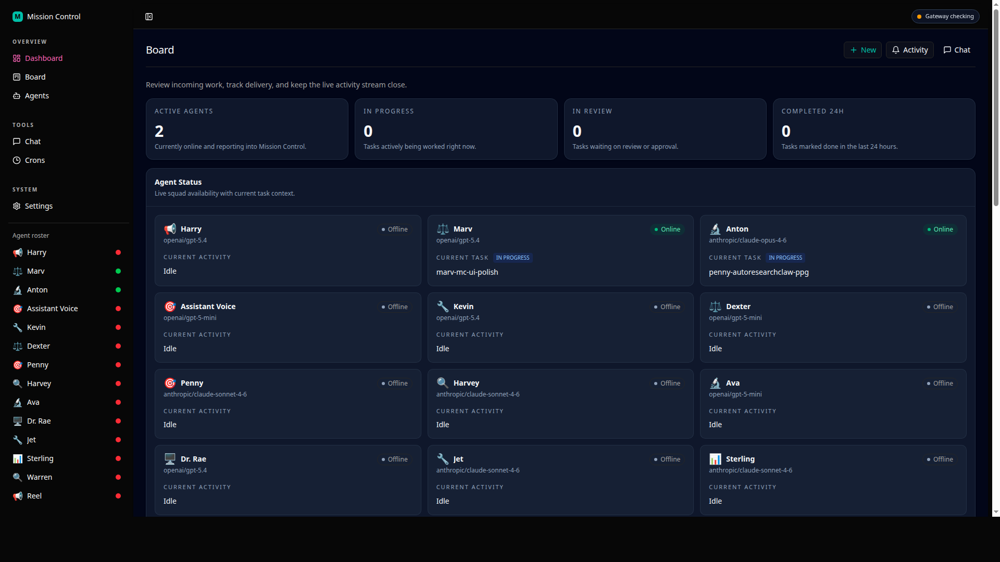
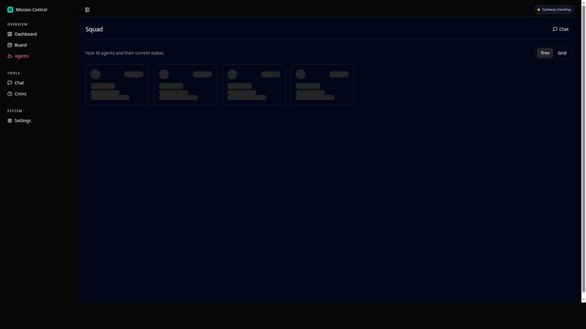
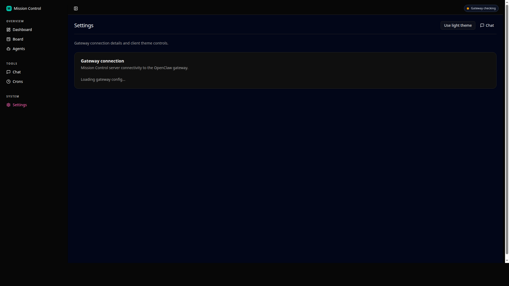

<div align="center">

# 🎛️ OpenClaw Mission Control

**The dashboard for your AI agent fleet.**

See every agent, manage every task, track everything in real-time.

[](LICENSE)
[](https://nodejs.org/)
[](https://www.typescriptlang.org/)
[](https://github.com/openclaw/openclaw)
[](CONTRIBUTING.md)

[Quick Start](#-quick-start) · [Screenshots](#-screenshots) · [Features](#-features) · [How It Works](#-how-it-works) · [Configuration](#-configuration) · [FAQ](#-faq)

</div>

---

## 📸 Screenshots

<table>
<tr>
<td width="50%">

### Kanban Board
Track tasks across your agent fleet with a drag-and-drop board. Each column represents a stage: Inbox, Assigned, In Progress, Review, and Done.



</td>
<td width="50%">

### Task Details
Click any task to see its full details, subtasks, comments, and review actions. Approve completed work or request changes.


</td>
</tr>
<tr>
<td width="50%">

### Agent Hierarchy
See your full agent fleet as an org chart. The tree is built automatically from your OpenClaw config: who delegates to whom, who's online, what they're working on.



</td>
<td width="50%">

### Settings & Cron Jobs
View your gateway connection status, instance details, and every scheduled cron job with schedules and last/next run times.



</td>
</tr>
</table>

---

## 📋 Prerequisites

- **Node.js 18+** — [Download](https://nodejs.org/)
- **OpenClaw** running on the same machine (or accessible via network)
- **Gateway auth token** from your OpenClaw instance

---

## 🚀 Quick Start

### Option 1: One Command (Recommended)

```bash
npx create-mission-control
```

The installer will walk you through setup:
1. Choose an install directory
2. Auto-detect your OpenClaw gateway URL and auth token
3. Install dependencies and build the app
4. Set up a systemd service (Linux) so it runs on boot
5. Show you the URL to access your dashboard

### Option 2: Shell Script

```bash
curl -fsSL https://raw.githubusercontent.com/sontakey/openclaw-mission-control/main/install.sh | bash
```

### Option 3: Manual Setup

```bash
# Clone the repo
git clone https://github.com/sontakey/openclaw-mission-control.git
cd openclaw-mission-control

# Install dependencies
npm install

# Build the app
npm run build

# Configure
cp .env.example .env
# Edit .env with your gateway URL and auth token (see Configuration below)

# Start the server
node dist/server/server/index.js
```

Open `http://localhost:3100` in your browser.

---

## ✨ Features

### Kanban Board
- **5 columns**: Inbox → Assigned → In Progress → Review → Done
- **Create tasks** from the UI with title, description, and priority
- **Assign tasks** to any agent in your fleet
- **Subtask tracking** with progress bars
- **Review workflow**: approve completed work or send feedback
- **Task plans**: group related tasks under a parent plan to track initiatives

### Agent Fleet Monitoring
- **Hierarchy view**: org-chart showing delegation structure (who spawns whom)
- **Grid view**: card-based layout with status badges
- **Real-time status**: online/offline based on active gateway sessions
- **Agent details**: model, heartbeat interval, current task, last seen
- **Works with any fleet**: reads agent config dynamically, no hardcoded agent names

### Live Activity Feed
- **Real-time updates** via Server-Sent Events (SSE)
- **Filter by type**: All, Tasks, Messages, Online
- **Activity types**: task created, status changed, comments, agent heartbeats
- **Timeline UI** with agent avatars and relative timestamps

### Chat Panel
- **Talk to any agent** directly from the dashboard
- **Agent selector** dropdown to pick which agent to message
- **Messages proxied** through the OpenClaw gateway sessions API
- **Chat history** loaded from gateway session transcripts

### Settings & Monitoring
- **Gateway connection**: status, URL, auth confirmation
- **Instance overview**: OpenClaw version, agent count, default model, channels
- **Cron job table**: every scheduled job with schedule, status, next/last run
- **Theme toggle**: dark mode (default) or light mode

---

## 🏗️ How It Works

Mission Control is a lightweight web app that sits alongside your OpenClaw instance. It talks to the OpenClaw gateway API to read agent status and send messages, and stores task/activity data in a local SQLite database.

```
┌──────────────────────────────────────────────────┐
│                   Your Browser                    │
│                                                   │
│   Board    │    Agents    │    Settings    │ Chat  │
└─────────────────────┬────────────────────────────┘
                      │ HTTP + SSE
                      ▼
┌──────────────────────────────────────────────────┐
│            Mission Control Server                 │
│            (Express + SQLite)                     │
│                                                   │
│   Tasks API ──── Activity Feed ──── Gateway Proxy │
│   (SQLite)       (SSE stream)       (HTTP client) │
└──────────────────────┬───────────────────────────┘
                       │ HTTP (Bearer token)
                       ▼
┌──────────────────────────────────────────────────┐
│              OpenClaw Gateway                     │
│              (your existing instance)             │
│                                                   │
│   Sessions  ·  Config  ·  Cron  ·  Chat History   │
└──────────────────────────────────────────────────┘
```

### What reads from the gateway (read-only)
- Agent list and config (`gateway config.get`)
- Active sessions and heartbeats (`sessions_list`)
- Chat history (`sessions_history`)
- Cron job schedules (`cron list`)

### What lives locally (SQLite)
- Tasks and subtasks
- Comments
- Activity log

### What writes to the gateway
- Chat messages to agents (`sessions_send`)

---

## ⚙️ Configuration

### Environment Variables

Create a `.env` file in the project root (or copy `.env.example`):

| Variable | Required | Default | Description |
|----------|----------|---------|-------------|
| `PORT` | No | `3100` | Port the dashboard runs on |
| `OPENCLAW_GATEWAY_URL` | No | `http://127.0.0.1:18789` | URL of your OpenClaw gateway |
| `OPENCLAW_TOKEN` | **Yes** | — | Gateway auth token (see below) |
| `DATABASE_FILE` | No | `mission-control.db` | Path to SQLite database |

### Finding Your Gateway Token

The dashboard needs your OpenClaw gateway auth token to communicate with your agents. Here's how to find it:

**Method 1: Check the OpenClaw environment file**
```bash
grep GATEWAY_AUTH_TOKEN ~/.openclaw/.env
```

**Method 2: Check the OpenClaw config**
```bash
cat ~/.openclaw/openclaw.json | grep -A2 '"auth"'
```
Look for the `token` field under `gateway.auth`. If it shows a `${VARIABLE}` reference, check your environment for that variable.

**Method 3: The npx installer auto-detects it**
```bash
npx create-mission-control
```
The interactive installer checks both locations automatically.

### Gateway API Access

Mission Control needs these gateway tools to be allowed in your OpenClaw config:

```json
{
  "gateway": {
    "tools": {
      "allow": [
        "sessions_send",
        "sessions_list",
        "sessions_history",
        "cron",
        "gateway"
      ]
    }
  }
}
```

If your gateway only allows `sessions_send` (the default), add the others. You can do this through the OpenClaw CLI:

```bash
openclaw config patch '{"gateway":{"tools":{"allow":["sessions_send","sessions_list","sessions_history","cron","gateway"]}}}'
```

### Agent Emojis and Roles

Mission Control reads agent configuration from your OpenClaw config. To customize how agents appear in the dashboard, add `identity` fields to your agent config:

```json
{
  "agents": {
    "list": [
      {
        "id": "myagent",
        "name": "My Agent",
        "identity": {
          "emoji": "🔧",
          "role": "Engineer"
        }
      }
    ]
  }
}
```

If no `identity.emoji` is set, Mission Control generates a consistent emoji based on the agent name. If no `identity.role` is set, it shows the agent's primary model name.

---

## 🖥️ Deployment

### Linux (systemd)

The installer renders [`deploy/systemd/mission-control.service`](deploy/systemd/mission-control.service) with your install path and installs it into `/etc/systemd/system/mission-control.service`.

If you need to do it manually:

```bash
sudo tee /etc/systemd/system/mission-control.service << EOF
[Unit]
Description=Mission Control — OpenClaw Agent Dashboard
After=network-online.target
Wants=network-online.target

[Service]
Type=simple
User=$USER
WorkingDirectory=/path/to/mission-control
Environment=NODE_ENV=production
EnvironmentFile=/path/to/mission-control/.env
ExecStart=$(which node) /path/to/mission-control/dist/server/server/index.js
Restart=always
RestartSec=5

[Install]
WantedBy=multi-user.target
EOF

sudo systemctl daemon-reload
sudo systemctl enable --now mission-control
```

### Tailscale Access

If your server runs Tailscale, the dashboard is automatically accessible from your Tailscale network:

```
http://your-hostname.tailnet-name.ts.net:3100
```

No additional configuration needed. The installer detects and displays your Tailscale URL.

### macOS / Other Platforms

Mission Control runs on any platform with Node.js 18+. On non-Linux systems, systemd setup is skipped. Start manually:

```bash
cd /path/to/mission-control
node dist/server/server/index.js
```

Or use a process manager like `pm2`:

```bash
npm install -g pm2
pm2 start dist/server/server/index.js --name mission-control
pm2 save
pm2 startup
```

---

## 📁 Project Structure

```
openclaw-mission-control/
├── src/                        # React frontend (Vite)
│   ├── components/
│   │   ├── kanban/             # Board, columns, cards, task detail
│   │   ├── agents/             # Agent cards, hierarchy tree
│   │   ├── chat/               # Chat panel components
│   │   ├── live-feed/          # Activity feed with SSE
│   │   ├── layout/             # Sidebar, header, page shell
│   │   └── ui/                 # Reusable UI primitives (shadcn/ui)
│   ├── hooks/                  # Data fetching hooks (SSE, tasks, agents)
│   ├── pages/                  # Board, Agents, Settings pages
│   ├── providers/              # React context providers
│   └── styles/                 # Global CSS with theme variables
├── server/                     # Express backend
│   ├── routes/
│   │   ├── tasks.ts            # Task CRUD + subtasks + comments
│   │   ├── agents.ts           # Agent status from gateway
│   │   ├── activities.ts       # Activity log + SSE stream
│   │   ├── chat.ts             # Chat proxy to gateway
│   │   ├── gateway.ts          # Config + cron proxy
│   │   └── health.ts           # Health check endpoint
│   ├── db.ts                   # SQLite schema + migrations
│   ├── gateway-client.ts       # HTTP client for OpenClaw gateway
│   ├── sse.ts                  # Server-Sent Events broadcaster
│   └── index.ts                # Express server entry point
├── packages/
│   └── create-mission-control/ # npx installer CLI
├── docs/screenshots/           # README screenshots
├── .env.example                # Configuration template
├── install.sh                  # Shell installer script
└── README.md                   # This file
```

---

## 🔄 Updating

```bash
cd /path/to/mission-control
git pull
npm install
npm run build
sudo systemctl restart mission-control  # Linux only
```

---

## Troubleshooting

- **"Connection refused"**: OpenClaw Gateway is not running, or `OPENCLAW_GATEWAY_URL` points to the wrong host or port.
- **"401 Unauthorized"**: `OPENCLAW_TOKEN` is missing or incorrect.
- **"Cannot GET /"**: Run `npm run build` first so the server can serve the compiled frontend from `dist/`.
- **Agent shows offline**: The agent needs an active session within the last 30 minutes, or an `in_progress` task.

---

## ❓ FAQ

### Does this work with any OpenClaw instance?
Yes. Mission Control reads agent configuration dynamically from the OpenClaw gateway API. No agent names, IDs, or roles are hardcoded. It works with 1 agent or 100.

### Does it need internet access?
No. Everything runs locally. The gateway connection is `localhost` by default. The only external call is during `npm install` to download packages.

### Where is the data stored?
Tasks, comments, and activity logs are stored in a local SQLite file (`mission-control.db`). Agent status is read live from the gateway (not stored). The database is created automatically on first run.

### Can I run it on a different machine than OpenClaw?
Yes. Set `OPENCLAW_GATEWAY_URL` to point to your remote gateway. Make sure the gateway is accessible (e.g., via Tailscale) and that the auth token is valid.

### How do I reset the task board?
Delete the SQLite database file and restart:
```bash
rm mission-control.db
sudo systemctl restart mission-control
```

### Can my agents create tasks programmatically?
Yes. The API is fully accessible:
```bash
curl -X POST http://localhost:3100/api/tasks \
  -H "Content-Type: application/json" \
  -d '{"title": "Build feature X", "assignee_agent_id": "marv", "priority": "high"}'
```

### What ports does it use?
Just one: `3100` by default (configurable via `PORT` env var). The Express server handles both the API and static file serving.

---

## 🤝 Contributing

Contributions welcome. Please open an issue first to discuss what you'd like to change.

```bash
# Development
npm install
npm run dev          # Vite dev server (frontend)
npm run dev:server   # Express dev server (backend)
npm run dev:full     # Both concurrently

# Build
npm run build

# Type check
npx tsc --noEmit -p tsconfig.json
npx tsc --noEmit -p tsconfig.server.json
```

---

## 📄 License

MIT

---

<div align="center">

Built for [OpenClaw](https://github.com/openclaw/openclaw)

</div>
